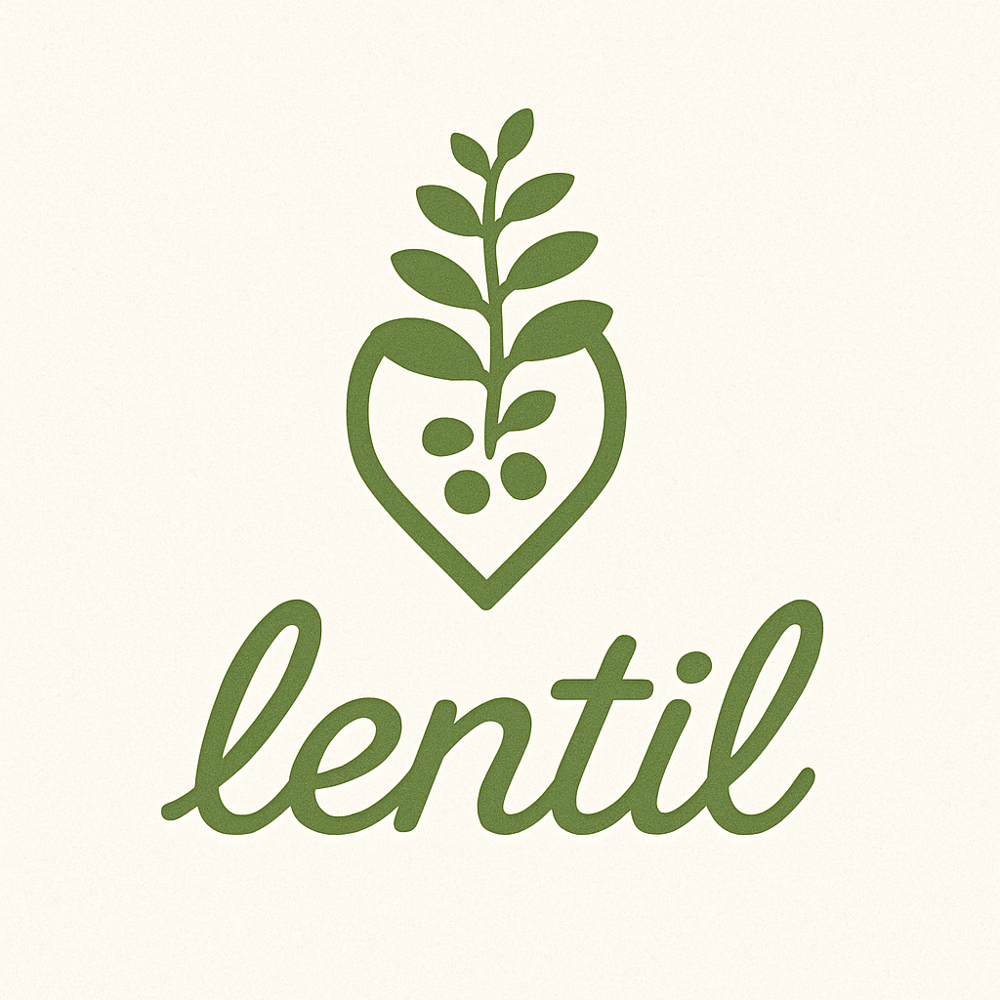

> *Fault-tolerant deployable chatroom backend • Built with Gleam & OTP*

```
⚠️  UNDER ACTIVE DEVELOPMENT • THINGS MAY BREAK  ⚠️
```

---
## **About**

Lentil is a self hostable chatroom backend for deploying custom chatroom application. 

Whether for creating in-house chatroom applications for your organization, or for creating a chatroom backend for a hackathon project, Lentil provides a smooth interface for writing your next big project!

> *coming soon
## **Features**
- Native telemetry dashboard
- Inbuilt authentication pipeline.
- Preconfigured PostgreSQL database
- *Optional 3rd party service integration not limited to:
  * Caching e.g Redis, HazelCast, etc.
  * Event streaming e.g Kafka, RabbitMQ, etc.
  * Logging

---

**[→ Full Docs coming soon](https://hexdocs.pm/lentil/)**

---

## 🧪 **Development**

```bash
gleam run    # Start server
gleam test   # Run tests
```

---

## 🤝 **Contributing**

All contributions are welcome under the contribution guidelines.

> Thank you for stopping by!